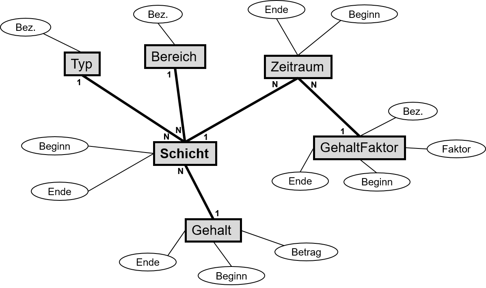
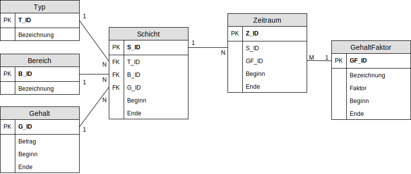

# 1. Die Datenbankanforderungen
## 1.1 Sprachliche Anforderung
- Jede Schicht ist von einem bestimmten **Typ**. Die Typen sind **Frühschicht**, **Spätschicht**, **Mitternachtssauna** und **Special**.

- Jede Schicht hat einen **zeitlichen Anfang** und ein **zeitliches Ende**. Dabei können Schichten auch **über 0 Uhr** gehen.

- An einem Tag können **bis zu zwei Schichten** absolviert werden. (Die Mitternachtssauna geht bis 3 Uhr und um 13:15 Uhr beginnt die Spätschicht).

- Der **Grundlohn** ist für jeden Schicht-Typ identisch. Jedoch gibt es je nach Schicht-Typ unterschiedliche **Zusatzleistungen**.

- Zu jeder Schicht soll notiert werden, in welchem **Bereich** gearbeitet wurde (Schwimmhalle oder Freibad).

- Ab 6 Stunden Arbeitszeit ist eine **Pause** Pflicht. Eine Pause hat einen zeitlichen Anfang und ein zeitliches Ende. Eine Pause kann zusätzlich von **zwei Typen** sein (Normal oder Bereitschaft).

## 1.2 ER-Diagramm

## 1.3 Relationenschreibweise

- Typ(**T_ID**, Bezeichnung)
- Bereich(**B_ID**, Bezeichnung)
- Zeitraum(**_S_ID_, _GF_ID_**, Beginn, Ende)
- GehaltFaktor(**GF_ID**, Bezeichnung, Faktor, Beginn, Ende)
- Gehalt(**G_ID**, Betrag, Beginn, Ende)
- Schicht(**S_ID**, _T_ID_, _B_ID_, _G_ID_, Beginn, Ende)

## 1.4 Relationenmodell

